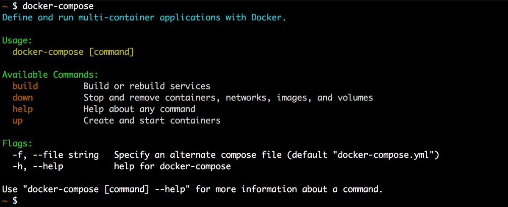

## Overview
🏔 **cliff** is a toolset which enables the creation of CLIs through a single YAML config file and no coding is required.

The YAML config file defines all the `commands`, including their `name`, `short` and `long` descriptions, number of `args`, `flags`, flag input types, subcommands, and more. All this gets dispayed in the CLI help output.

Each command could also specify a `run` instruction in the YAML config file which can be any bash command and has access to the `args` and `flags`. For even more control, the `run` instruction can be omitted form the YAML config file and built in code using [Golang](https://golang.org/)

## Example
The following is a simple YAML config file of what a subset of the `docker-compose` CLI would look like if it was using **cliff**

```yaml
name: docker-compose
short: Define and run multi-container applications with Docker.
flags:
  - long: file
    short: f
    type: string
    description: Specify an alternate compose file
    default: docker-compose.yml
    global: true
commands:
  - name: build
    short: Build or rebuild services
    run: echo Build TODO!
  - name: up
    short: Create and start containers
    run: echo Up TODO!
  - name: down
    short: Stop and remove containers, networks, images, and volumes
    run: echo Down TODO!
```

This is the output of running the `docker-compose` command


